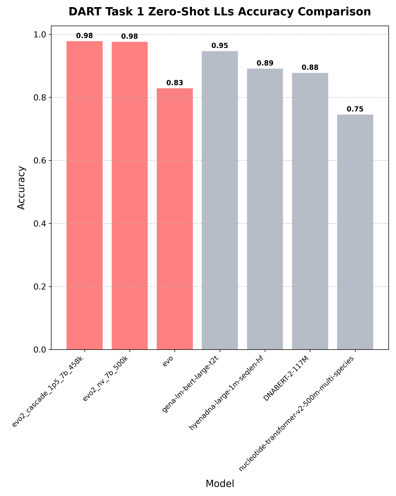
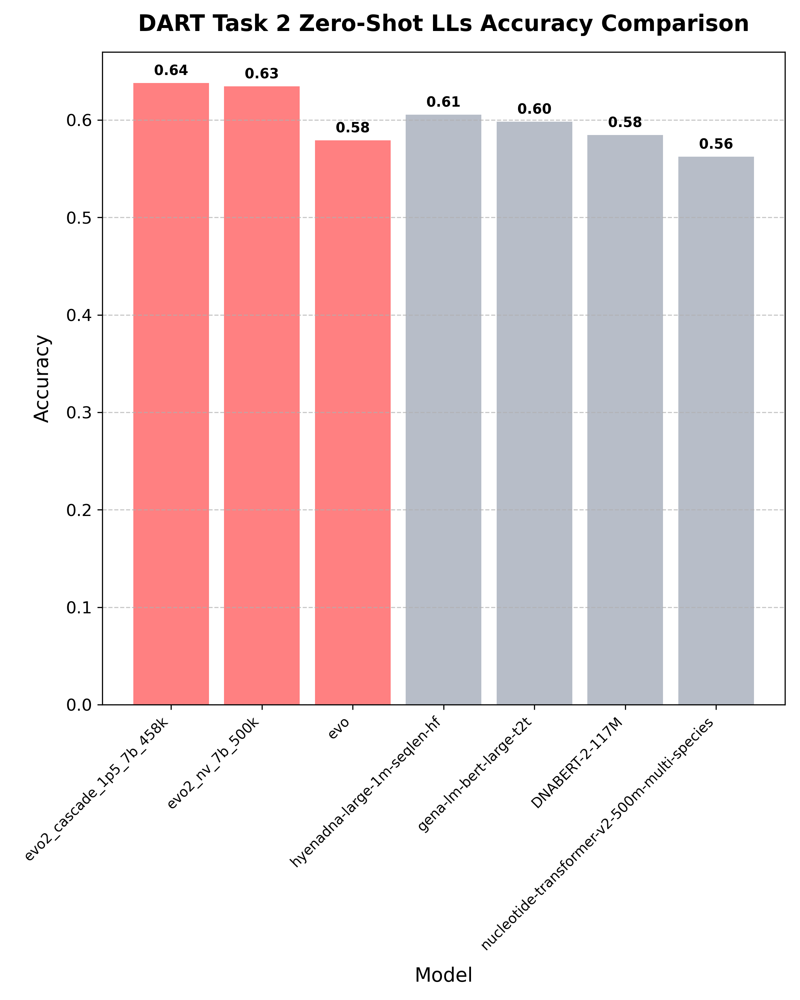

# DART-Eval Plotting Scripts

## Scripts Overview

IMPORTANT: `DART_WORK_DIR` environment variable must be set (currently set to `/large_storage/hsulab/kzhu/DART_work_dir`). 
Other results are stored in the `/large_storage/hsulab/kzhu/DART_work_dir/` directory.

All scripts below are located in `/scripts_plotting/`

### Main Scripts:
1. `eval_DART_zeroshot_lls_t1.sh` - Evaluates zero-shot likelihoods for Task 1
2. `eval_DART_zeroshot_lls_t2.sh` - Evaluates zero-shot likelihoods for Task 2
3. `extract_DART_embeddings_t1.sh` - Extract embeddings for Task 1
4. `extract_DART_embeddings_t2.sh` - Extract embeddings for Task 2
5. `extract_DART_embeddings_t3.sh` - Extract embeddings for Task 3
6. `DART_t1_zeroshot_lls_plot.py` - Generates plots for Task 1 results
7. `DART_t2_zeroshot_lls_plot.py` - Generates plots for Task 2 results

### Usage:

To switch the Evo model being used, update the `MODEL_SPECIFIC_NAME` variable in the script. Additionally, 
ensure that the model name is updated within the Python script to match. 

Run Task 1 evaluation:
`sbatch eval_DART_zeroshot_lls_t1.sh`
`sbatch extract_DART_embeddings_t1.sh` # Extract embeddings for Task 1

Run Task 2 evaluation:
`sbatch eval_DART_zeroshot_lls_t2.sh`
`sbatch extract_DART_embeddings_t2.sh` # Extract embeddings for Task 2

Run Task 3 evaluation:
`sbatch extract_DART_embeddings_t3.sh` # Extract embeddings for Task 3

Generate plots:
`python DART_t1_zeroshot_lls_plot.py`
`python DART_t2_zeroshot_lls_plot.py`

## Preliminary Results
### Task 1 Zero-shot Likelihood Results

### Task 2 Zero-shot Likelihood Results  

### Task 3 Zero-shot Likelihood Results  
Results are stored in `$DART_WORK_DIR/task_3_peak_classification/clustering`

### Task 5 Zero-shot Embedding Results  
Results are stored in `/src/dnalm_bench/task_2_5_single/experiments/task_5_variant_effect_prediction/Zero_Shot_Final.ipynb`

